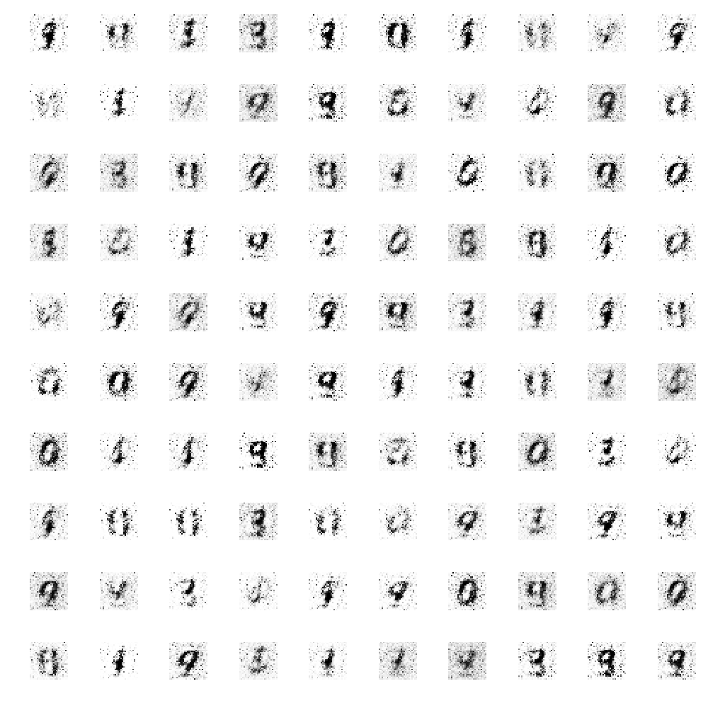
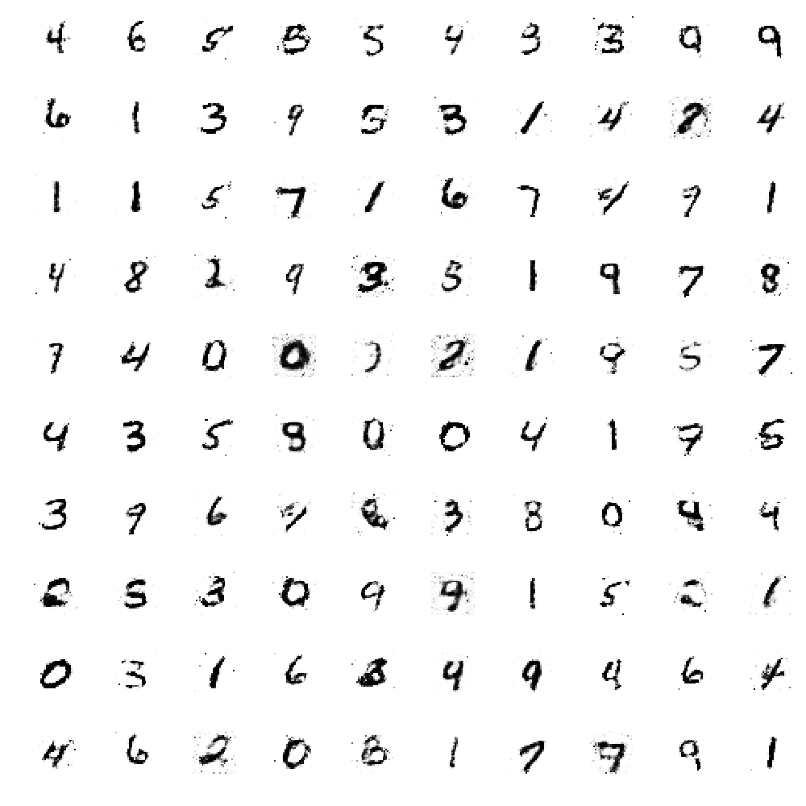

## Generative neural network

Learning project for generative neural network.

Project uses a generative neural network to create handwritten digits from MNIST dataset.

One can see the improvement of algorithm after 1 epoch:

after 40 epochs

